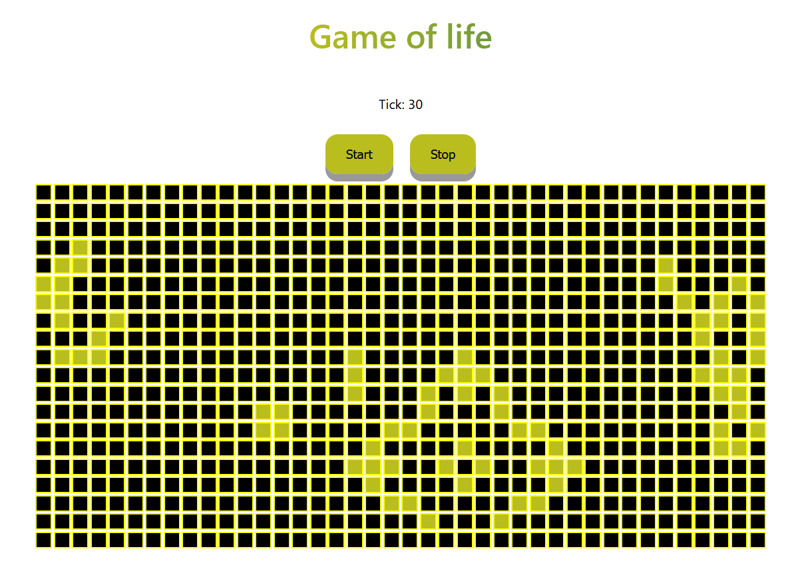

# Welcome the game of life client implementation

This app is built with react and remix. 

- [Remix Docs](https://remix.run/docs)

This is the client implementation of the game, game of life



## Prerequisites 
npm 

remix

services used by this app is defined here: [game-of-life-service](https://github.com/lilo4591/game-of-life), follow the guide there to set up the service. 

## Run app locally
clone this repo

When you have the service running you can start this app in development mode by running this from your terminal.

```sh
npm run dev
```

Head to a browser and type in

```
localhost:3000
```

You can choose which cells that you want to start with by clicking on them och then you start by clicking the start button. You can stop the game by clicking the stop button.

### Game of life rules (from Wikipedia)

The universe of the Game of Life is an infinite, two-dimensional orthogonal grid of square cells, each of which is in one of two possible states, live or dead (or populated and unpopulated, respectively). Every cell interacts with its eight neighbours, which are the cells that are horizontally, vertically, or diagonally adjacent. At each step in time, the following transitions occur:

* Any live cell with fewer than two live neighbours dies, as if by underpopulation.
* Any live cell with two or three live neighbours lives on to the next generation.
* Any live cell with more than three live neighbours dies, as if by overpopulation.
* Any dead cell with exactly three live neighbours becomes a live cell, as if by reproduction.


### Improvements ideas for future
* Be able to unclick buttons that are clicked
* Be able to clear the board
* Stop simulation when there are no active cells
* Make more use of remix framework instead of react as of today

